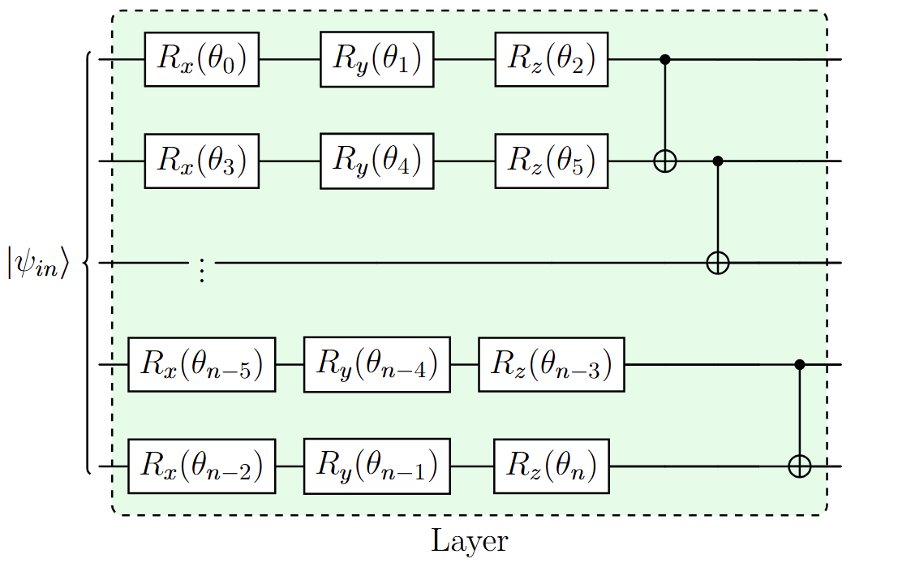

# QuantumBlueReal
Variational Quantum Eigensolver implementation, aimed to be implemented in **Quantum Blue at BSC**.


---

## Introduction

This project implements a **hybrid quantum-classical VQE workflow** to compute molecular ground state energies. 

### Table of contents
  - Introduction
  - Envioronment and clone repository
  - How to use
  - Configuration example
  - Molecule & Hamiltonian Builder
  - Ansatz

---
## Envioronment and clone repository
  **1. Packages to install**
    - Qibo
    - (...)
    
  **2. Clone repository**

    git clone https://github.com/pebejko/QuantumBlueReal
    
    cd QuantumBlueReal

---
## How to use
  **1. Prepare the config.yaml**

  **2. Run the VQE**

    python main.py
---
## Configuration example
  Example of `config.yaml` file:

```
# ------------------ Ansatz ------------------
ansatz:
  type: HEA1          # Nombre de la clase de ansatz
  layers: 2           # Número de capas
  connectivity: [[0,1]]     # Opcional: lista de tuplas de qubits a entrelazar

# ------------------ Backend ------------------
backend:
  simulator: qibojit   # "qibojit" para simulación, o "hardware" para QPU
  runcard: "/path/to/runcard"  # Solo si quieres ejecutar en QPU real
  shots: 100

# ------------------ Optimización ------------------
adam_params:
  lr: 0.001
  betas: [0.9, 0.999]
  eps: 1e-8
  weight_decay: 0.0

max_epochs: 150

# ------------------ Checkpoint ------------------
checkpoint_file: "results/checkpoint.pkl"

# ------------------ VQE Options ------------------
vqe:
  restart: true 
  checkpoint_interval: 50
  print_interval: 10

# Seed for reproducibility
seed: 42

# Molecular system (H2 simple)
geometry:
  - ["N", [0.0, 0.0, 0.0]]
  - ["H", [0.0, 0.0, 0.74]]   # Common distance H2
basis: "sto-3g"
multiplicity: 1
charge: 0

# Active space or frozen orbitals (opcional)
active_electrons: 3
active_orbitals: 3

# Symmetry options
use_symmetry: "true"
```

---

## Molecule and Hamiltonian Builder
This step is responsible for translating a real molecular system into a form suitable for quantum computation. It has two main tasks:
- Reads the molecule’s geometry, atomic types, total charge, and multiplicity from `config.yaml`.
- Uses the function `build_molecule(config)` to create a molecular object (`mol_data`) containing all relevant information about the atoms, positions, and electronic structure.
- Converts the molecular information into a Pauli Hamiltonian, which is a sum of terms with coefficients and Pauli operators (`X, Y, Z`) acting on qubits.
- Uses `build_pauli_hamiltonian_qibo(mol_data, config)` to produce both a Qibo/OpenFermion Hamiltonian (`hamiltonian_op`) and a list of Pauli terms (`hamiltonian_list`) ready for measurement.
  
---

## Ansatz 
The ansatz is the parameterized quantum circuit used in VQE. Its role is to generate a trial wavefunction for the molecule whose energy we want to minimize.
- We use **Hardware-Efficient Ansatz (HEA)** designed to match the available qubit connectivity and minimize circuit depth.
- **Layers** (`n_layers`): Each layer applies a set of rotation gates on each qubit followed by entangling gates according to the specified connectivity.
- **Parameterized gates:** The angles of the rotation gates are the trainable parameters that the classical optimizer (Adam) updates.
- **Expressibility:** More layers increase flexibility to approximate the true ground state, but also increase circuit depth and cost.
  
  
